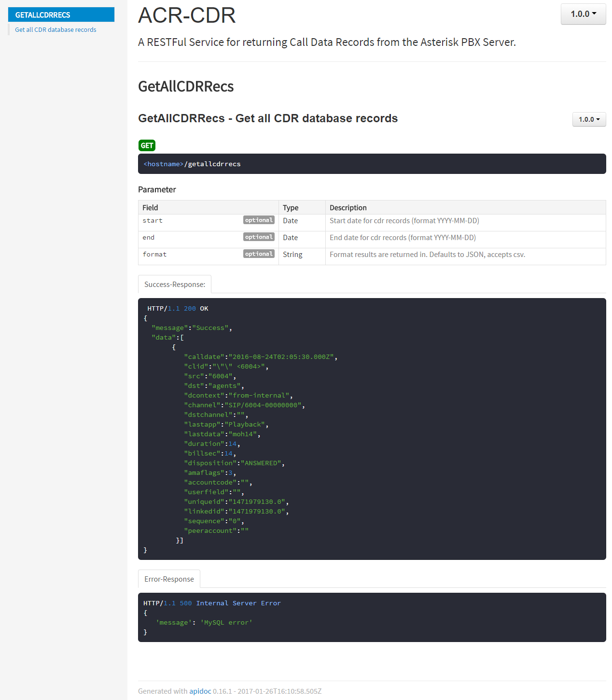

# ACR-CDR

Call Detail Records (CDR) RESTful API.

## Deployment

Configuraiton and deployment of this server is part of the overall `ace-direct` installation process. See [../README.md](../README.md) for full details.

## Generating APIdocs

1. Run `npm install apidoc -g` to install apidoc
1. From the project folder run `apidoc -i routes/ -o apidoc/`
1. The APIDocs can be accessed from `<hostname>:<port>/apidoc/`

## REST Calls

### /GetAllCDRRecs

Returns a JSON Object containing all records from the Asterisk CDR database.

#### Parameters

* **start** - (*optional*) Start date for cdr records (format YYYY-MM-DD)
* **end** - (*optional*) End date for cdr records (format YYYY-MM-DD)
* **format** - (*optional*) Format results are returned in. Defaults to JSON, accepts csv.

## License

This software was produced for the U.S. Government under
Contract Number HHSM-500-2012-00008I, and is subject to Federal Acquisition
Regulation Clause 52.227-14, Rights in Data-General. No other use other than
that granted to the U.S. Government, or to those acting on behalf of the U.S.
Government under that Clause is authorized without the express written
permission of The MITRE Corporation.

For further information, please contact:

> The MITRE Corporation\
> Contracts Management Office\
> 7515 Colshire Drive\
> McLean, VA 22102-7539\
> (703) 983-6000

©2016 The MITRE Corporation.

